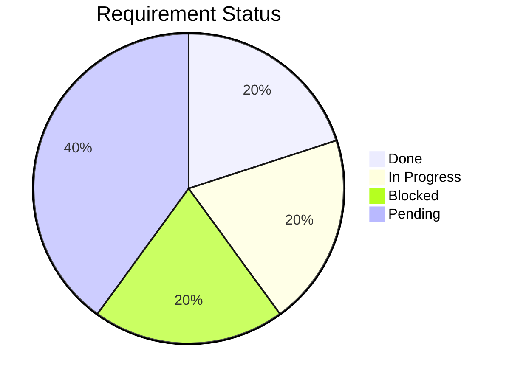
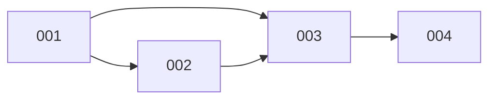

# `.dev/blueprint.md` — 示例

以下是一个在中等规模项目中使用 spec-coding-skill 时自动生成的蓝图示例：

---

```markdown
# Project Blueprint

Last updated: 2026-05-10

## Status Distribution



## Progress Bar

```
001 user-auth     [████████░░░░░░░░░░░░] 40%  (07 Execution)
002 task-crud     [██░░░░░░░░░░░░░░░░░░] 10%  (04 Plan)
003 team-collab   [████░░░░░░░░░░░░░░░░] 20%  (02 Prerequisite)
004 notification  [░░░░░░░░░░░░░░░░░░░░] 0%   (01 Init)
005 data-export   [████████████████████] 100% (07 Done ✅)

Overall:          [████████████░░░░░░░░] 34%
```

## Roadmap

| ID | Name | Phase | Status | Dependencies | Priority | Notes |
|---|---|---|---|---|---|---|
| 001 | user-auth | 07 Execution | ▶ in-progress | - | P0 | T-003: implement login handler (in-progress) |
| 002 | task-crud | 04 Plan | ⏳ pending | 001 | P1 | waiting for auth API to stabilize |
| 003 | team-collab | 02 Prerequisite | ⏸ blocked | 001, 002 | P2 | blocked on PR review for 001 |
| 004 | notification | 01 Init | ⏳ pending | 003 | P2 | |
| 005 | data-export | 07 Done | ✅ done | - | P1 | shipped in v1.0 |

**Phase labels:** `01 Init` · `02 Prerequisite` · `03 Algorithm` · `04 Plan` · `05 Tasks` · `06 Start-and-resume` · `07 Execution` · `07 Done`
**Status labels:** `⏳ pending` · `▶ in-progress` · `⏸ blocked` · `✅ done`
**Priority labels:** `P0` blocking · `P1` core · `P2` nice-to-have

## Progress Summary

```
Total: 5 requirements
✅ Done:  1 (005)
▶ Active: 1 (001)
⏸ Blocked: 1 (003)
⏳ Idle:  2 (002, 004)
```

## Key Dependencies



## Milestones

| Milestone | Target | Status | Requirements |
|---|---|---|---|
| v1.0 MVP | 2026-06-15 | ▶ on track | 001, 002 |
| v1.1 Collaboration | 2026-07-30 | ⏳ planning | 003, 004 |
| v2.0 GA | 2026-09-01 | ⏳ pending | 005 |

**Status labels:** `▶ on track` · `⚠ at risk` · `⏸ delayed` · `✅ achieved`

## Effort Overview

| Req | Name | Estimate | Actual | Remaining |
|-----|------|----------|--------|-----------|
| 001 | user-auth | L | M | ~2d |
| 002 | task-crud | XL | - | ~5d |
| 003 | team-collab | M | - | ~3d |
| 004 | notification | S | - | ~1d |
| 005 | data-export | M | M | ✅ done |
| **Total** | | | | **~11d** |

**Estimate labels:** `XS` ≤1d · `S` ≤3d · `M` ≤1w · `L` ≤2w · `XL` >2w

## Quick Reference

| Document | Location |
|---|---|
| Blueprint | `.dev/blueprint.md` |
| TODO (cross-req) | `.dev/TODO.md` |
| Requirement docs | `.dev/NNN-req-name/` |

## How to Read

- **✅ done (005)**: all tasks complete — no action needed
- **▶ in-progress (001)**: actively being worked on — check `tasks.md` for current task
- **⏸ blocked (003)**: blocked by external dependency — read `tasks.md` Notes for details
- **⏳ pending (002, 004)**: ready to start once dependencies resolve
- **Overall**: 34% complete, 2 requirements needed for v1.0 MVP milestone

**Recommended next**: continue 001-user-auth (T-003), or if urgent, prepare 002-task-crud Phase 05
```
